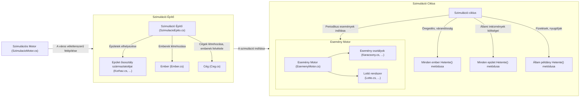
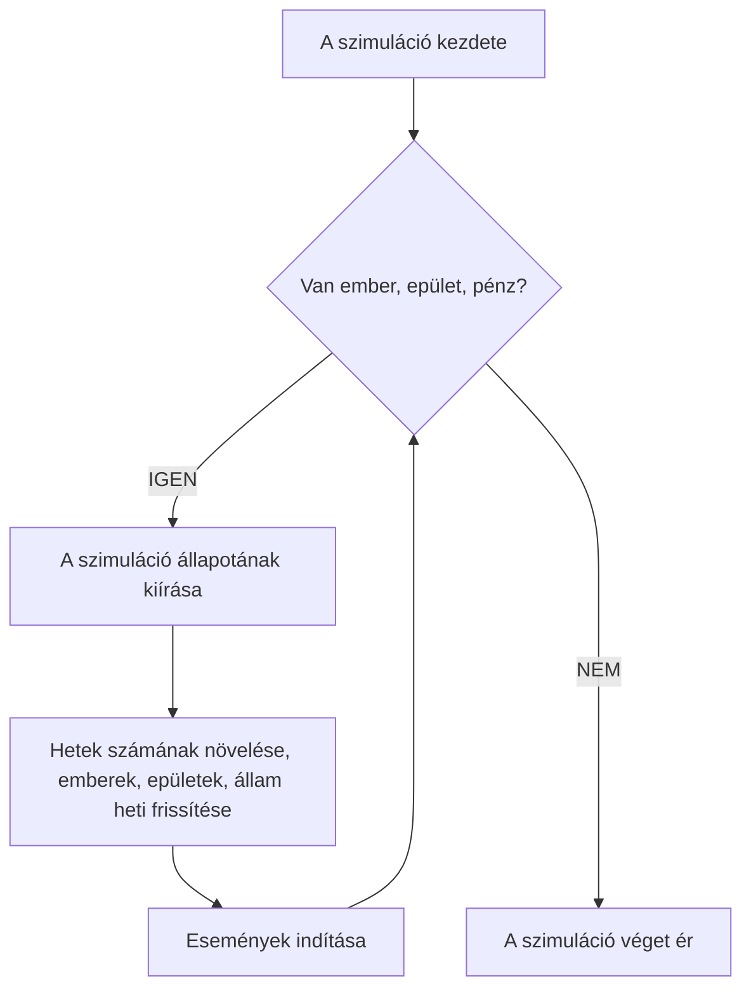

# 11.D Város Projekt

## A csapatok kiosztása

### 1. Csapat: Lakosság
- Nguyen Van Tamás (Csapatvezető)
- Szilágyi Domonkos
- Major Bence

### 2. Csapat: Gazdaság
- Fata Dávid (Csapatvezető)
- Kereszturi Balázs
- Csíkszentmihályi Döme
- Pongor Márk

### 3. Csapat: Epületek
- Fébert András (Csapatvezető)
- Juhász Cecília
- Fodor Balázs
- Béki Zsolt

### 4. Csapat: Események
- Gyárfás Bálint (Csapatvezető)
- Heim Péter Máté (Csapatvezető helyettes)
- Huszti Tamás
- Rábai Miklós

## Dokumentáció

### Áttekintés

A projekt egy város működését próbálja szimulálni emberekkel, epületekkel, eseményekkel és működő egy gazdasággal. A szimulált város egy a forint értékéhez közeli, meg nem nevezett pénznemet használ a fizetések, költségek, adók számításakor. Az objektumorientált programozáshoz megfelelő módon, több osztállyal van kialakítva a végső projekt, amelyek csoportokra bonthatók az általuk ellátott feladat szempontjából. Ezek a csoportok a mapparendszer szerint a következők: Epület, Események, Gazdaság, Lakosság, és Szimuláció.

### Fő osztályok, és kapcsolataik

- **SzimulacioMotor**: Felel a város kezdőállapotának kialakításáról (a SzimulacioEpito osztállyal együttműködve), és futtatja a szimulációt (EsemenyMotor, Allam és más osztályokat használva).
- **SzimulacioEpito**: Véletlenszerűen készíti el a szimuláció kezdő állapotát, epületeket helyez el, emberek készít és ad nekik munkát, cégeket alapít.
- **EsemenyMotor**: A véletlen események indításáért és a heti lottó húzásért felel.
- **Ember**: A szimuláció egészén használt. Követi az emberek életkorát, házassági állapotát, és a lakosság növekedését/csökkenését is megvalósítja.
- **Allam**: Egy ország gazdaságát modellezi. Számontartja az állampolgárokat, cégeket, és az államnak elérhető pénzösszeget. Nyugdíjat fizet a rá jogosult állampolgároknak.
- **Bankszamla**: Abstract osztály, amiből két bankszámlatípus van származtatva. Minden pénzügyi tranzakció rajta keresztül valósul meg.
    - **MaganBankszamla**: Egy bankszámla, amiben long típusként számon van tartva a jelenlegi egyenleg.
    - **AllamiBankszamla**: Végtelen pénzzel rendelkező számla. Eredetileg az állam használta, de azóta leváltásra került egy MaganBankszamla példánnyal, így most használatlan.
- **Lotto**: A heti lottó sorsolásért felelős. Számontartja a jackpot összegét, és lehetővé teszi az emberek számára a szelvények vásárlását.
- **Epulet**: Az épület osztály ősosztálya minden a városban megtalálható épületnek. A közöttük mind megjelenő adattagokat (mint a karbantartottsági szintjük), és metódusokat (Foldrenges()) tartalmazza.

### A program működése ábrázolva

<h4 align="center">A szimuláció felépítése</h4>

<h4 align="center">A szimulációs motor működése</h4>

